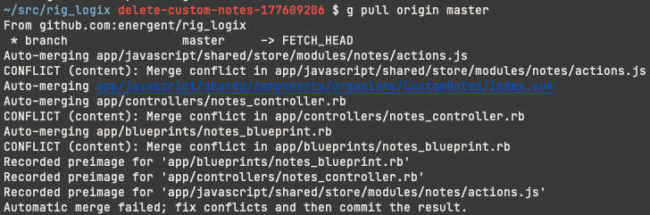

# Git Rerere

Git rerere = reuse recorded resolution

It remembers how you resolved merge conflicts and applies
them automatically.

```bash
git config --global rerere.enabled true
```

## How can you use it?

First, you can update a tree of branches without headache.
Second, if you have a long live branch, you can
periodically integrate master in it and undo the merge
commit, so that you won't have merge conflicts when it is
time to merge master in.


